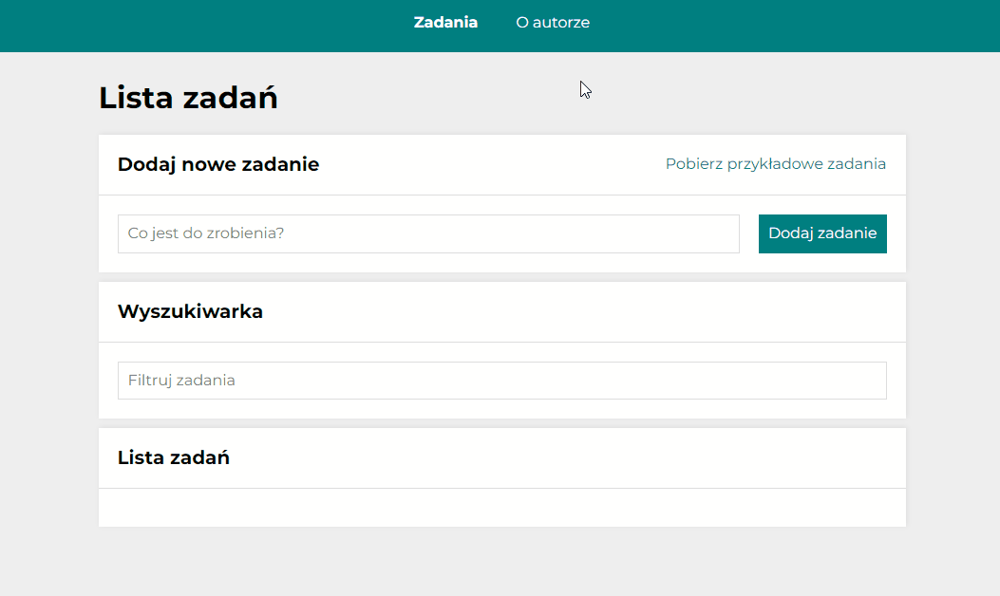

# ✅ To-do list in React

Welcome to my "to-do list" app!

This project is a part of the Frontend Developer course that I'm participating in and was bootstrapped with [Create React App](https://github.com/facebook/create-react-app).

## Table od content

* [Demo](#demo)
* [Preview](#preview)
* [How to use](#how-to-use)
* [Available scripts](#available-scripts)
* [Technologies](#technologies)
## Demo

You can find a demo [here](https://paulgrym.github.io/to-do-list-react/).

## Preview

## How to use
At the top of the page you can see a navigation to a tasks page and to an author page.

The author page is very simple - it contains a short info about me, whereas the tasks page is more complex and it consists of as many as three blocks. These block are as follows:

### `Tasks adding block` 

In this block you can add as many tasks as you want or download example tasks by clicking "Pobierz przykładowe zadania" button. Tasks will appear below - in "Tasks list block" creating the list.
### `Search bar block`

With its use you can filter tasks.
### `Tasks list block`
 
 In this block every task added in "Tasks adding block" is displayed in a company of two buttons - green and red. By clicking the green one you can mark and unmark the task as done. Red button is for removing tasks from the list. You can go to the subpage of each task with one click on its content.  

 Additionally, you can hide completed tasks by clicking "Ukryj ukończone" button" or you can mark all of tasks as done by clicking "Ukończ wszystkie" button.

## Available Scripts

In the project directory, you can run:

### `npm start`

Runs the app in the development mode.\
Open [http://localhost:3000](http://localhost:3000) to view it in the browser.

The page will reload if you make edits.\
You will also see any lint errors in the console.

### `npm run build`

Builds the app for production to the `build` folder.\
It correctly bundles React in production mode and optimizes the build for the best performance.

The build is minified and the filenames include the hashes.\
Your app is ready to be deployed!

See the section about [deployment](https://facebook.github.io/create-react-app/docs/deployment) for more information.

### `npm run eject`

**Note: this is a one-way operation. Once you `eject`, you can’t go back!**

If you aren’t satisfied with the build tool and configuration choices, you can `eject` at any time. This command will remove the single build dependency from your project.

Instead, it will copy all the configuration files and the transitive dependencies (webpack, Babel, ESLint, etc) right into your project so you have full control over them. All of the commands except `eject` will still work, but they will point to the copied scripts so you can tweak them. At this point you’re on your own.

You don’t have to ever use `eject`. The curated feature set is suitable for small and middle deployments, and you shouldn’t feel obligated to use this feature. However we understand that this tool wouldn’t be useful if you couldn’t customize it when you are ready for it.

## Technologies

- HTML
- JavaScript (ES6+)
- CSS (Flex, Grid, media queries)
- React
- Create-react-app
- Styled-components
- ThemeProvider
- Redux / Toolkit
- Redux-Saga
- React Router
- Custom Hooks
- Promises, async/await
- Local storage

